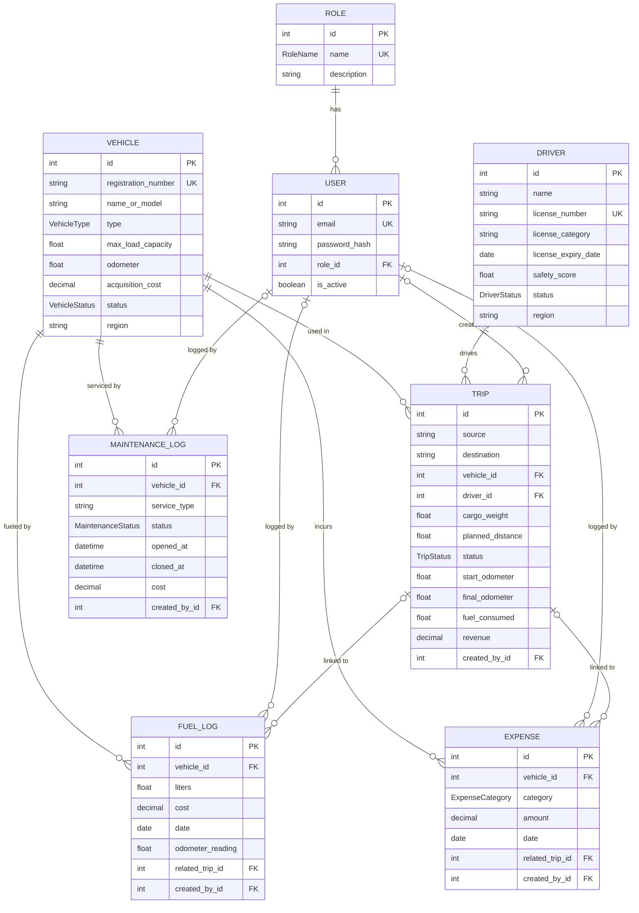

# TransitOps — Entity Relationship Diagram

Visual reference for `schema.prisma`. Renders automatically on GitHub. Source of truth is the Prisma schema + migrations.

**Legend:** `||--o{` one-to-many (required parent) · `|o--o{` one-to-many (optional parent) · PK primary key · FK foreign key · UK unique.

**Constraints:** unique (`registration_number`, `license_number`, `email`, `role.name`); foreign keys on all links (Restrict on master data, SetNull on optional links); 15 CHECK constraints (positive/non-negative amounts, `safety_score` 0–100). Cross-row rule `cargo_weight <= vehicle.max_load_capacity` is enforced in the service layer.
